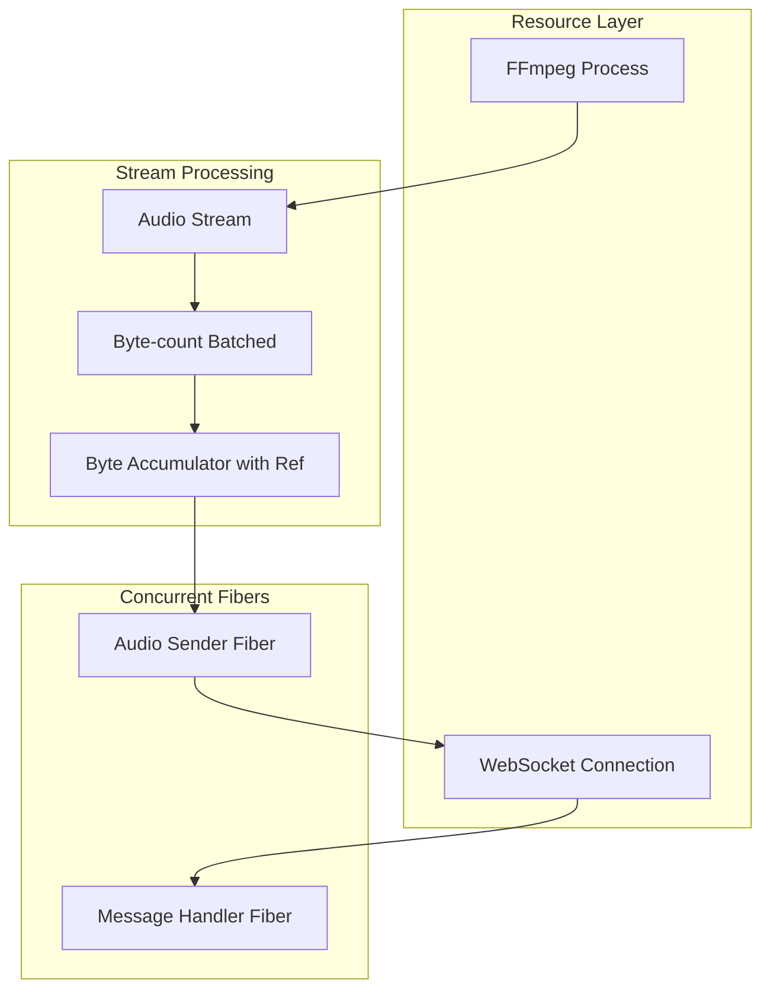

# Convert openai_realtime.ts to Effect

## Output File

Create new file: [openai_realtime_effect.ts](openai_realtime_effect.ts)

## Current Implementation Analysis

The existing [openai_realtime.ts](openai_realtime.ts) uses byte-count thresholds for batching:

- `BATCH_THRESHOLD`: ~20ms of audio (~960 bytes) for sending chunks
- `COMMIT_BYTES`: 3 seconds of audio (144,000 bytes) for committing
- `TARGET_BYTES`: 15 seconds of audio (720,000 bytes) for requesting responses

## Effect Architecture



## Key Conversions

### 1. Constants (byte-based thresholds)

```typescript
const SUMMARY_INTERVAL = 15 // seconds
const COMMIT_INTERVAL = 3  // seconds
const BYTES_PER_SECOND = 24000 * 2 // 24kHz, 16-bit mono
const TARGET_BYTES = SUMMARY_INTERVAL * BYTES_PER_SECOND  // 720,000
const COMMIT_BYTES = COMMIT_INTERVAL * BYTES_PER_SECOND   // 144,000
const BATCH_THRESHOLD = Math.floor(BYTES_PER_SECOND / 50) // ~960 bytes
```

### 2. FFmpeg Process with Command.stream

```typescript
const ffmpegStream = (audioUrl: string) =>
  Command.make(
    "ffmpeg",
    "-fflags", "+nobuffer",
    "-flags", "+low_delay",
    "-probesize", "32",
    "-analyzeduration", "0",
    "-i", audioUrl,
    "-f", "s16le",
    "-ar", "24000",
    "-ac", "1",
    "-flush_packets", "1",
    "-"
  ).pipe(Command.stream)
```

### 3. WebSocket as a Managed Resource

```typescript
class OpenAIWebSocket extends Context.Tag("OpenAIWebSocket")<
  OpenAIWebSocket,
  {
    readonly send: (message: string) => Effect.Effect<void>
    readonly messages: Stream.Stream<WebSocketMessage>
  }
>() {}

const OpenAIWebSocketLive = Layer.scoped(
  OpenAIWebSocket,
  Effect.gen(function* () {
    const apiKey = yield* Config.redacted("OPENAI_API_KEY")
    const ws = yield* Effect.acquireRelease(
      connectWebSocket(apiKey),
      (ws) => Effect.sync(() => ws.close())
    )
    // ... return service with send and messages stream
  })
)
```

### 4. Byte-count Based Batching with Stream.mapAccum

Instead of time-based `groupedWithin`, use `mapAccum` to accumulate bytes:

```typescript
// Accumulate chunks until BATCH_THRESHOLD bytes
const batchByBytes = <E>(stream: Stream.Stream<Uint8Array, E>) =>
  stream.pipe(
    Stream.mapAccum(
      { buffer: [] as Uint8Array[], size: 0 },
      (state, chunk) => {
        const newSize = state.size + chunk.length
        if (newSize >= BATCH_THRESHOLD) {
          const combined = Buffer.concat([...state.buffer, chunk])
          return [{ buffer: [], size: 0 }, Option.some(combined)]
        }
        return [{ buffer: [...state.buffer, chunk], size: newSize }, Option.none()]
      }
    ),
    Stream.filterMap(identity)
  )
```

### 5. Stateful Byte Tracking with Ref

Track accumulated bytes for commit/response triggers:

```typescript
interface AudioState {
  accumulatedBytes: number
  bytesSinceCommit: number
  lastResponseTime: number
}

const processAudioChunk = (
  state: Ref.Ref<AudioState>,
  ws: OpenAIWebSocket,
  chunk: Buffer
) =>
  Effect.gen(function* () {
    // Send audio
    yield* ws.send(JSON.stringify({
      type: "input_audio_buffer.append",
      audio: chunk.toString("base64")
    }))
    
    // Update state and check thresholds
    const current = yield* Ref.updateAndGet(state, (s) => ({
      ...s,
      accumulatedBytes: s.accumulatedBytes + chunk.length,
      bytesSinceCommit: s.bytesSinceCommit + chunk.length
    }))
    
    // Commit if threshold reached
    if (current.bytesSinceCommit >= COMMIT_BYTES && 
        current.accumulatedBytes < TARGET_BYTES) {
      yield* ws.send('{"type":"input_audio_buffer.commit"}')
      yield* Ref.update(state, (s) => ({ ...s, bytesSinceCommit: 0 }))
    }
    
    // Request response if target reached
    if (current.accumulatedBytes >= TARGET_BYTES) {
      yield* ws.send('{"type":"input_audio_buffer.commit"}')
      yield* ws.send('{"type":"response.create"}')
      yield* Ref.set(state, { accumulatedBytes: 0, bytesSinceCommit: 0, lastResponseTime: Date.now() })
    }
  })
```

### 6. Message Handler with Terminal Service

Use `Terminal` from `@effect/platform` for stdout output (provided by `BunContext.layer` via `BunTerminal.layer`):

```typescript
import { Terminal } from "@effect/platform"

const handleMessage = (
  activeResponseRef: Ref.Ref<string | null>
) => (message: WebSocketMessage) =>
  Effect.gen(function* () {
    const terminal = yield* Terminal.Terminal
    
    switch (message.type) {
      case "response.output_text.delta":
        // Stream text output using Terminal.display
        yield* terminal.display(message.delta ?? "")
        break
      case "response.done":
        yield* terminal.display("\n")
        yield* Effect.log(`Response done: ${message.response?.status}`)
        yield* Ref.set(activeResponseRef, null)
        break
      case "error":
        yield* Effect.logError("OpenAI error", message)
        break
    }
  })
```

### 7. Main Program Composition

```typescript
const program = Effect.gen(function* () {
  const ws = yield* OpenAIWebSocket
  const state = yield* Ref.make<AudioState>({ 
    accumulatedBytes: 0, 
    bytesSinceCommit: 0, 
    lastResponseTime: 0 
  })
  const activeResponse = yield* Ref.make<string | null>(null)
  
  // Configure session
  yield* ws.send(JSON.stringify({ type: "session.update", session: { ... } }))
  
  // Fork message handler
  yield* Effect.fork(Stream.runForEach(ws.messages, handleMessage(activeResponse)))
  
  // Process audio stream with byte-based batching
  const audioUrl = "https://stream.radiofrance.fr/franceinfo/franceinfo_hifi.m3u8"
  yield* ffmpegStream(audioUrl).pipe(
    batchByBytes,
    Stream.runForEach((chunk) => processAudioChunk(state, ws, chunk))
  )
})
```

### 8. Layer Composition and Execution

```typescript
const MainLive = Layer.mergeAll(
  OpenAIWebSocketLive,
  BunContext.layer
)

BunRuntime.runMain(program.pipe(Effect.provide(MainLive)))
```

## Key Effect Patterns Used

- `Effect.gen` for generator-based sequencing
- `Command.stream` for subprocess output streaming
- `Stream.mapAccum` for byte-count based batching (NOT time-based)
- `Layer.scoped` + `Effect.acquireRelease` for resource management
- `Ref` for mutable state (byte counters, active response)
- `Effect.fork` for concurrent message handling
- `Terminal.Terminal` from `@effect/platform` for stdout output (via `BunContext.layer`)
- `Data.TaggedError` for typed errors
- `BunRuntime.runMain` for execution with automatic SIGINT/SIGTERM handling